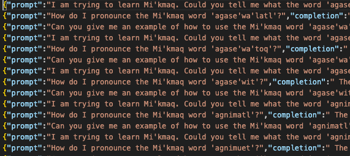
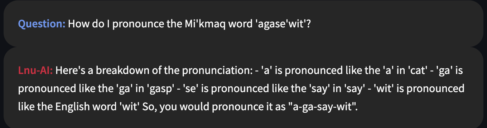
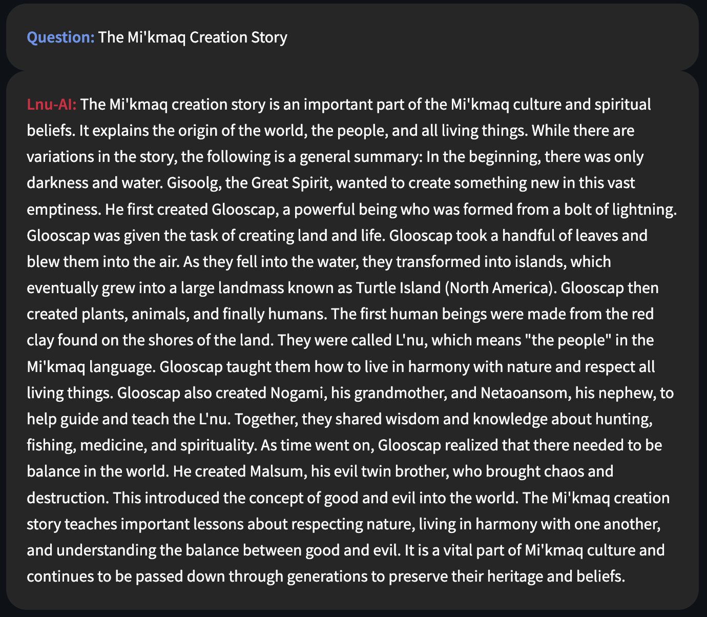

# Lnu-AI Chat Feature Overview

The `Chat` feature in Lnu-Ai creates a groundbreaking platform where users can engage in real-time conversations with an AI, powered by machine learning and natural language processing. This unique feature is meticulously designed to incorporate the Mi'kmaq language, thus paving the way for an immersive linguistic experience.

  

## Features

- **Real-Time Conversations**: The Chat feature enables users to interact with the AI in real-time, creating an engaging and responsive conversation environment.

- **Language Learning**: With each interaction, the AI uses Mi'kmaq phrases and words, providing users with the opportunity to learn and use the language in a conversational context.

- **Customizable Experiences**: The AI can adjust its conversational style based on user preferences, allowing for a highly personalized chatting experience.

---
### Example Conversations

  

  

---
## User Guide

Engaging with the Chat feature is as simple as:

1. Navigate to the Chat tab in the application interface.
2. Start a conversation with the AI by typing in the provided text box.
3. Hit 'Enter' to send your message and wait for the AI's response.

## Future Developments

We envision making the Chat feature even more interactive and versatile by:

- Integrating voice recognition and speech-to-text capabilities.
- Enhancing the AI's contextual understanding for more meaningful conversations.
- Implementing features that allow users to customize the AI's language proficiency level.

As we continue developing these features, we remain open to contributions from the community. Developers, users, and Mi'kmaq language enthusiasts are welcome to provide feedback, suggestions, and contributions to enhance the Chat feature and help in preserving and promoting the beautiful Mi'kmaq language. 

---

For more information on the project and other features of Lnu-AI, refer to the [Project Statement](ProjectStatement.md).

---

Developed by [Madie Laine](https://twitter.com/justmadielaine)
