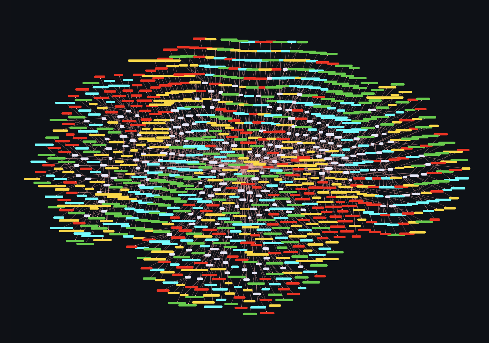
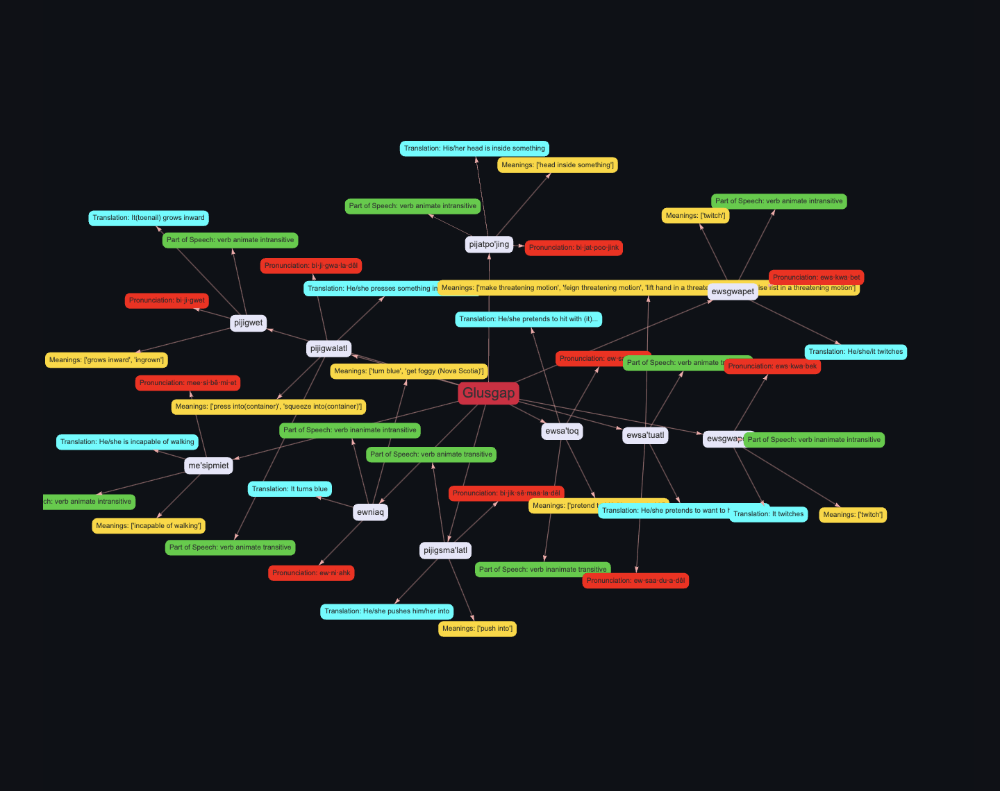
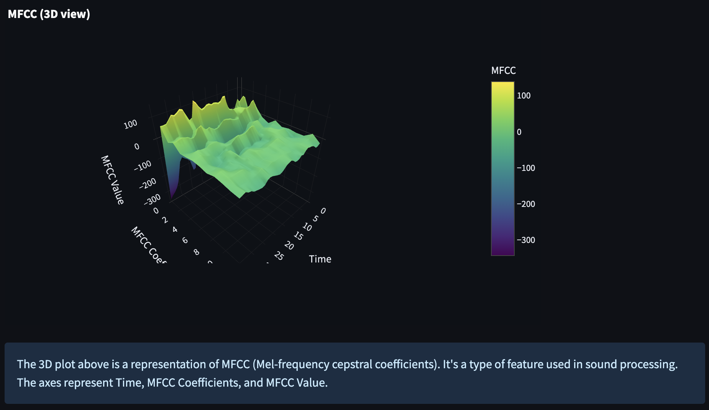
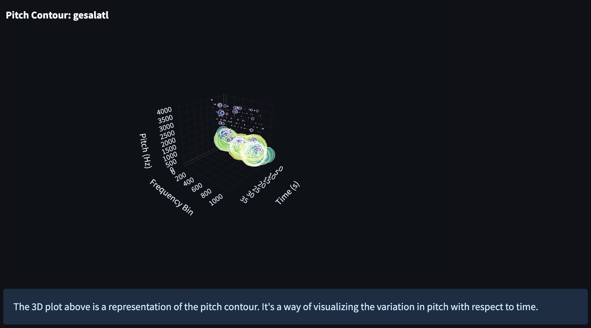
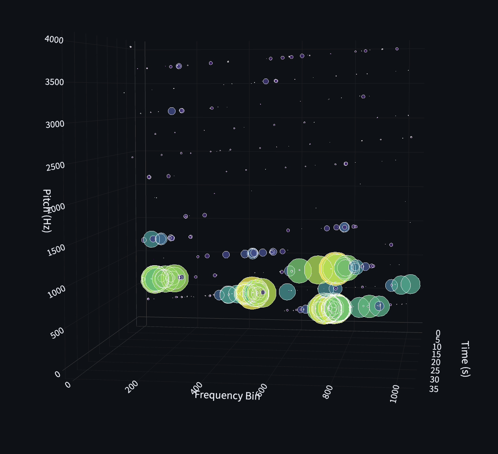
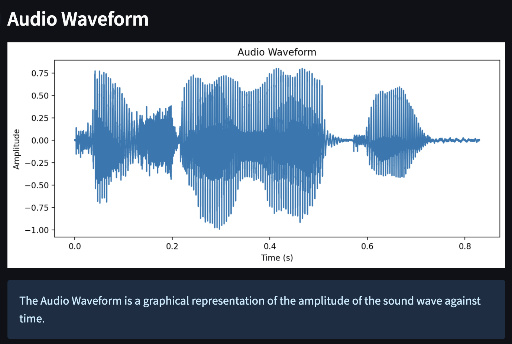
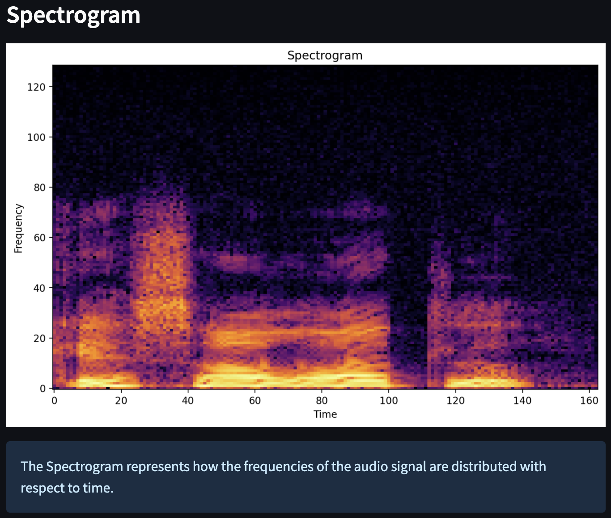

# Lnu-AI Examine Words Feature Overview

The `Examine Words` feature in Lnu-AI opens up a world of deep linguistic exploration, enabling users to delve into the intricate web of relationships and connections between Mi'kmaq words. It utilizes cutting-edge technologies such as word embeddings, cosine similarity for vector representation, and audio analysis for native pronunciation, all woven together in an intuitive, interactive visual system.

  

---
## Features

### Word Visualization Nodes
Every Mi'kmaq word is represented as a node, with the connections between nodes showing semantic or syntactic relationships based on word embeddings. This method visualizes words in a shared space, giving users a unique view of the structural connections between different words and phrases in the Mi'kmaq language.

  

### Cosine Similarity for Connection Strength
To determine the strength of connections between words, the `Examine Words` feature uses cosine similarity - a measure of similarity between two vectors. This mathematical tool allows us to quantify the similarity between two words, represented by their vectors in high-dimensional space.

  

### Sound of Words and Pronunciation Analysis
`Examine Words` goes beyond textual relationships and extends into the realm of pronunciation. By analyzing audio recordings from native speakers, it breaks down how each word is pronounced and represents it as a visual vector. This feature provides an invaluable tool for users aiming to perfect their Mi'kmaq pronunciation.

  

### Orthographic Variance Visualization
The Mi'kmaq language, like many Indigenous languages, possesses rich orthographic variation. `Examine Words` acknowledges this linguistic diversity by visually representing the variance, helping users understand the spectrum of possible spellings and related words.

  

### Orthographic Variance Visualization
The Mi'kmaq language, like many Indigenous languages, possesses rich orthographic variation. `Examine Words` acknowledges this linguistic diversity by visually representing the variance, helping users understand the spectrum of possible spellings and related words.

  

### Orthographic Variance Visualization
The Mi'kmaq language, like many Indigenous languages, possesses rich orthographic variation. `Examine Words` acknowledges this linguistic diversity by visually representing the variance, helping users understand the spectrum of possible spellings and related words.

  

---
## User Guide

To get the most out of `Examine Words`, simply:

1. Navigate to the `Examine Words` tab in the application interface.
2. Enter the word you want to examine in the provided text box.
3. The system will generate a visual representation of the word and its connections.

## Future Developments

Our vision for the `Examine Words` feature is to continually evolve it by:

- Expanding the word database to include an even larger selection of Mi'kmaq words.
- Enhancing the AI's understanding of Mi'kmaq phonetics for more accurate pronunciation analysis.
- Implementing user feedback to fine-tune and improve the feature's functionality.

We welcome contributions, suggestions, and feedback from all users - developers, language enthusiasts, and anyone passionate about preserving and promoting the beautiful Mi'kmaq language.

---

For more information on the project and other features of Lnu-AI, refer to the [Project Statement](ProjectStatement.md).

---

Developed by [Madie Laine](https://twitter.com/justmadielaine)
